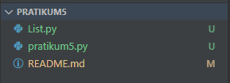
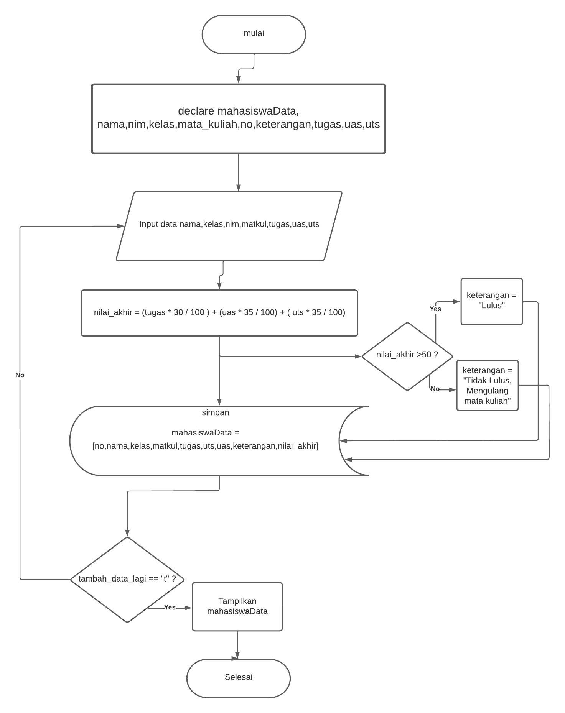
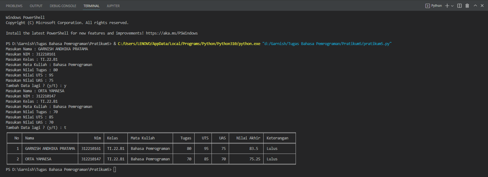

## Latihan Membuat list, menambahkan, mengedit, mengambil elemen pada list di Python.

#### Repository ini sebagai tugas Mata kuliah Bahasa Pemrogramman.

1. Baik Pertama-tama buatlah sebuah Folder `Praktikum5` dan didalamnya diisi File `List.py` & `Praktikum5.py` seperti berikut :

    `Note Untuk penamaan folder dan file bisa sesuai keinginan kalian`

   

2. Selanjutnya buka file `List.py` lalu masukan code dibawah ini :

   ```Python
   # membuat 5 list dengan type data yang berbeda

    listData = ["Teknik Informatika", "UPB", 650000, True, "Fakultas Teknik"]

    ###########################
    # mengakses element list #
    #########################

    # menampilkan element ke-3 pada sebuah list
    print(listData[2])

    # menampilkan elemen ke-2 sampai ke-4
    print(listData[1:4])

    # menampilkan elemen terakhir
    print(listData[4])
    # atau bisa juga seperti ini
    print(listData[-1])

    ##########################
    # Mengubah element list #
    ########################

    # Merubah elemen ke-4 dengan nilai lain
    listData[3] = False
    print(listData)

    # Merubah elemen ke-4 sampai dengan terakhir degan nilai lain
    listData[3:5] = [True, "TI22B1"]
    print(listData)

    ##########################
    # Menambah element list #
    ########################

    # membuat listA dan diisi oleh element yang ada di listData
    listA = listData

    # membuat list B dengan element masih kosong
    listB = []

    # mengambil 2 nilai dari listA lalu simpan ke listB
    listB = listA[0:2]
    print(listB)

    # Menambahkan list B dengan nilai string
    listB.append("Fakultas Teknik")
    print(listB)

    # Menambahkan list B dengan 3 nilai
    listB.extend(["Teknik Sipil", "Teknik Lingkungan", "Teknik Industri"])
    print(listB)

    # Menggabungkan list B dengan listA
    listGabungan = listA + listB
    print(listGabungan)
    ```

3. Selanjutnya jalankan file dengan cara buka terminal lalu ketikan `python List.py` dan berikut hasilnya :

    


## Membuat program input data mahasiswa beserta nilai dan disimpan didalam List.

  Berikut Flowchart program yang akan kita buat :

  

#### Requirement
- Pip [install pip](https://pypi.org/project/pip/)
- Cara install pip [cara install pip](https://www.anbidev.com/python-pip/)
- Package Tabulate

1. Pertama kita install Package `Tabulate` dengan cara buka terminal lalu copas `pip install tabulate` sebagai berikut :

    

2. Lalu buka file `Praktikum5.py` dan masukan code berikut

    ```Python
    # import package tabulate
    from tabulate import tabulate

    # membuat list kosong untuk menampung data
    dataMahasiswa = []
    no = 0
    # melakukan perulangan input sesuai keinginan sampai pertanyaan tambah data dimunculkan kembali
    while(True):
    # membuat variable untuk menampung inputan
    no += 1
    nama = input("Masukan Nama : ")
    nim = input("Masukan NIM : ")
    kelas = input("Masukan Kelas : ")
    matkul = input("Masukan Mata Kuliah : ")

    # mengkonversi string ke integer
    tugas = int(input("Masukan Nilai Tugas : "))
    uts = int(input("Masukan Nilai UTS : "))
    uas = int(input("Masukan Nilai UAS : "))

    # menjumlahkan nilai dari tugas,uts dan uas
    nilai_akhir = (tugas * 30 / 100) + (uts * 35 / 100) + (uas * 35 / 100)

    # lakukan pengecekan jika nilai_akhir lebih besar dari 50 maka Lulus selain itu tidak lulus dan mengulang mata kuliah
    if (nilai_akhir > 50):
        keterangan = "Lulus"
    else:
        keterangan = "Tidak Lulus, Mengulang Mata kuliah"
    # menambahkan data input ke list dataMahasiswa
    dataMahasiswa.append(
        [no, nama, nim, kelas, matkul, tugas, uts, uas, nilai_akhir, keterangan])

    # input tambah data jika tekan y maka input kembali, selain itu berhenti dan tampilkan data
    tambah_data_lagi = input("Tambah Data lagi ? (y/t) : ")
    if(tambah_data_lagi == "t"):
        break

    # tampilkan dataMahasiswa menggunakan tabulate package agar tampilan berbentuk table
    print(tabulate(dataMahasiswa, headers=[
          "No", "Nama", "Nim", "Kelas", "Mata Kuliah", "Tugas", "UTS", "UAS", "Nilai Akhir", "Keterangan"], tablefmt="fancy_grid"))
    ```

3. Selanjutnya jalankan file dengan cara buka terminal lalu ketikan `python Praktikum5.py` dan berikut hasilnya :

    

    `Selesai terima kasih`<br>
    `Garnish Andhika pratama \`
    `312210161`

    [saweria](https://saweria.co/adamwebdev)
